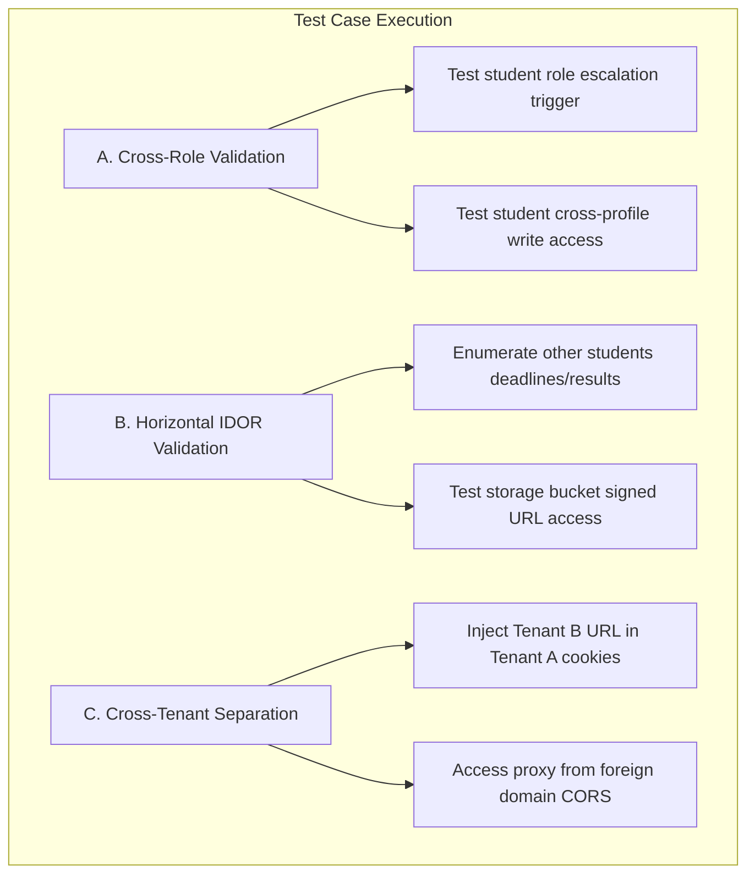

# Senior Review Validation & Architectural Reconciliation Report

This document reviews and validates the feedback provided by the Senior Software Engineer regarding the ClassApp systems audit. It reconciles security practices, checks database schemas, and outlines improvements for edge-cases.

---

## 1. Summary of Feedback Validation

| Senior Engineer Feedback Point | Validation Status | Codebase Finding | Architectural Recommendation |
| :--- | :--- | :--- | :--- |
| **AES-256-GCM Registry Encryption vs. Plaintext Cookies** | 🟢 **Validated** | `tenants.supabase_anon_key` is stored as plaintext in [0001_master_schema.sql](file:///c:/Users/User/Desktop/classapp/supabase/migrations/0001_master_schema.sql) and read directly in [auth-tenant.ts](file:///c:/Users/User/Desktop/classapp/src/lib/actions/auth-tenant.ts). | **Transition to Encrypted Storage at Rest:** Store encrypted keys in the DB. Decrypt in memory on the server during connection and deliver to client via `httpOnly` cookies. |
| **Exposing `tenant_supabase_url` to client-side JS** | 🟢 **Validated** | Cookie is set as `httpOnly: false` to allow the browser client to build its cache key in [client.ts](file:///c:/Users/User/Desktop/classapp/src/lib/supabase/client.ts). | **Convert to httpOnly:** The browser client only calls the proxy `/api/supabase-proxy`. The proxy reads the cookie server-side. The client can use the non-sensitive local storage key `tenant_class_name` for cache invalidation. |
| **Silent Discards in Role Update Trigger** | 🟢 **Validated** | Trigger `check_profile_role_update` in [0000_complete_schema.sql](file:///c:/Users/User/Desktop/classapp/supabase/migrations/0000_complete_schema.sql) reverts unauthorized changes silently without raising an error. | **Raise Database Exception:** Replace silent revert with a database error (`RAISE EXCEPTION`) to fail transactions completely and prevent testing bugs from going unnoticed. |
| **Rate Limiter & FCM Multi-Device Storage** | 🟢 **Validated** | Limiter uses local Edge worker memory. FCM tokens use a single string column on profiles. | **Implement Redis & Device Table:** Use the existing Upstash Redis instance for Edge rate-limiting and migrate the single FCM token column to a dedicated multi-device relationship table. |
| **Cloudflare Turnstile vs. hCaptcha** | 🟢 **Validated** | The codebase uses Cloudflare Turnstile (mapped via `@marsidev/react-turnstile` in [package.json](file:///c:/Users/User/Desktop/classapp/package.json)). | **Document Current Configuration:** Confirm the project uses Turnstile. The senior engineer's reference to hCaptcha was outdated. |

---

## 2. Detailed Validation & Design Analysis

### A. Registry Encryption at Rest
*   **The Issue:** The Senior Engineer noticed a mismatch between the description of "encrypted credential storage" and cookies delivery.
*   **Code Review:** Checking the Master schema [0001_master_schema.sql:L26-34](file:///c:/Users/User/Desktop/classapp/supabase/migrations/0001_master_schema.sql#L26-L34), `supabase_anon_key` is stored as plaintext. In the Server Action [auth-tenant.ts:L15-25](file:///c:/Users/User/Desktop/classapp/src/lib/actions/auth-tenant.ts#L15-L25), keys are fetched and written to cookies in plaintext.
*   **Resolution:** The database lacks encryption at rest for the master tenant configurations. To secure this:
    1.  Encrypt `supabase_anon_key` (and optionally `supabase_url`) using `aes-256-gcm` prior to database insertion.
    2.  Set a `MASTER_ENCRYPTION_KEY` env variable on Vercel.
    3.  Decrypt the key in [auth-tenant.ts](file:///c:/Users/User/Desktop/classapp/src/lib/actions/auth-tenant.ts) before setting it in the secure cookie.

```javascript
// Conceptual Decryption in Server Action:
import crypto from 'crypto';

function decrypt(cipherText: string, masterKey: string) {
  const [ivHex, encryptedHex, authTagHex] = cipherText.split(':');
  const decipher = crypto.createDecipheriv('aes-256-gcm', Buffer.from(masterKey, 'hex'), Buffer.from(ivHex, 'hex'));
  decipher.setAuthTag(Buffer.from(authTagHex, 'hex'));
  return decipher.update(encryptedHex, 'hex', 'utf8') + decipher.final('utf8');
}
```

### B. Securing the `tenant_supabase_url` Cookie
*   **The Issue:** The `tenant_supabase_url` cookie is `httpOnly: false`, exposing the dedicated database URL to client-side scripts.
*   **Code Review:** In [client.ts:L14](file:///c:/Users/User/Desktop/classapp/src/lib/supabase/client.ts#L14), client-side code parses `tenant_supabase_url` from `document.cookie` to set a cache key to invalidate client singletons when switching classes:
    ```typescript
    const cacheKey = `${targetUrl}::${tenantUrl}`;
    ```
*   **Resolution:** 
    1.  Change `tenant_supabase_url` to `httpOnly: true` inside [auth-tenant.ts](file:///c:/Users/User/Desktop/classapp/src/lib/actions/auth-tenant.ts).
    2.  Because the browser client routes requests through the proxy API endpoint (`window.location.origin + '/api/supabase-proxy'`), it does not need to know the database URL.
    3.  In [client.ts](file:///c:/Users/User/Desktop/classapp/src/lib/supabase/client.ts), read the non-sensitive public identifier `tenant_class_name` from local storage to construct the cache invalidation key:
    ```typescript
    const className = typeof window !== 'undefined' ? localStorage.getItem('tenant_class_name') || '' : '';
    const cacheKey = `${targetUrl}::${className}`;
    ```

### C. Trigger Error Feedback for Role Changes
*   **The Issue:** The trigger `check_profile_role_update` silently reverts the role change.
*   **Code Review:** In [0000_complete_schema.sql:L394-396](file:///c:/Users/User/Desktop/classapp/supabase/migrations/0000_complete_schema.sql#L394-L396):
    ```sql
    ELSE
      -- Silently revert unauthorized role change
      NEW.role = OLD.role;
    END IF;
    ```
*   **Resolution:** To make testing reliable and avoid masking bugs, replace the silent discard with a database exception. An exception halts transaction execution and provides clear feedback:
    ```sql
    ELSE
      RAISE EXCEPTION 'Role modification is not allowed. Transaction aborted.'
        USING ERRCODE = '42501'; -- Insufficient Privilege
    END IF;
    ```

### D. Cloudflare Turnstile vs. hCaptcha Verification
*   **The Issue:** The Senior Engineer recalled hCaptcha.
*   **Code Review:** The lockscreen implementation uses **Cloudflare Turnstile**:
    *   Dependency: `@marsidev/react-turnstile` in [package.json:L17](file:///c:/Users/User/Desktop/classapp/package.json#L17).
    *   Endpoint: [verify-turnstile/route.ts:L29](file:///c:/Users/User/Desktop/classapp/app/api/auth/verify-turnstile/route.ts#L29) sends verification payloads directly to `challenges.cloudflare.com`.
*   **Resolution:** The project has indeed migrated to Turnstile. The documentation is accurate; the reviewer's reference is outdated.

---

## 3. Implementation Plans for Senior Engineer Proposals

The Senior Engineer proposed two deliverables:

### Part 1: FCM Multi-Device Storage Migration Plan
Currently, FCM tokens are saved as a single column on `profiles.fcm_token`. To support multiple active devices per student:

#### A. Database Schema Migration Script
Deploy a schema migration to support multiple tokens per user:
```sql
-- migration.sql
CREATE TABLE IF NOT EXISTS public.fcm_devices (
    id           UUID PRIMARY KEY DEFAULT gen_random_uuid(),
    user_id      UUID NOT NULL REFERENCES public.profiles(id) ON DELETE CASCADE,
    fcm_token    TEXT NOT NULL UNIQUE,
    device_label TEXT,
    created_at   TIMESTAMPTZ NOT NULL DEFAULT now(),
    last_seen_at TIMESTAMPTZ NOT NULL DEFAULT now()
);

CREATE INDEX IF NOT EXISTS idx_fcm_devices_user_id ON public.fcm_devices(user_id);

-- Backfill: migrate existing token column into the new table
INSERT INTO public.fcm_devices (user_id, fcm_token, created_at, last_seen_at)
SELECT id, fcm_token, created_at, updated_at
FROM public.profiles
WHERE fcm_token IS NOT NULL AND fcm_token <> ''
ON CONFLICT (fcm_token) DO NOTHING;

-- Enable RLS
ALTER TABLE public.fcm_devices ENABLE ROW LEVEL SECURITY;

-- Policies
CREATE POLICY "fcm_devices_select_own"
  ON public.fcm_devices FOR SELECT
  TO authenticated
  USING (user_id = auth.uid());

CREATE POLICY "fcm_devices_insert_own"
  ON public.fcm_devices FOR INSERT
  TO authenticated
  WITH CHECK (user_id = auth.uid());

CREATE POLICY "fcm_devices_delete_own"
  ON public.fcm_devices FOR DELETE
  TO authenticated
  USING (user_id = auth.uid());
```

#### B. Logic Updates in Server Action `push.ts`
Reconcile how notifications are dispatched and managed in `push.ts`:
1.  **Register Token:**
    ```typescript
    export async function saveFcmToken(token: string) {
      const supabase = await getSupabaseServerClient();
      const { data: { user } } = await supabase.auth.getUser();
      if (!user) return { success: false, error: 'Unauthorized' };

      // Upsert into fcm_devices. If token exists, update last_seen_at.
      const { error } = await supabase
        .from('fcm_devices')
        .upsert(
          { user_id: user.id, fcm_token: token, last_seen_at: new Date().toISOString() },
          { onConflict: 'fcm_token' }
        );
      
      return { success: !error, error: error?.message };
    }
    ```
2.  **Broadcast Notification:**
    Modify `sendFCMPush` to query tokens from `fcm_devices`. When a token is returned as `UNREGISTERED` or `INVALID_ARGUMENT` by Firebase, delete the row from `fcm_devices` to keep the table clean:
    ```typescript
    // Fetch all relevant fcm_devices
    let query = supabase.from('fcm_devices').select('user_id, fcm_token');
    if (payload.targetUserId) {
      query = query.eq('user_id', payload.targetUserId);
    }
    const { data: devices } = await query;
    
    // During iteration, if request returns 404/410/UNREGISTERED:
    await supabase.from('fcm_devices').delete().eq('fcm_token', token);
    ```

---

### Part 2: RLS / IDOR Test Suite Specification

This test plan exercises authorization boundaries, proxy security, and access controls.



#### A. Cross-Role Validation (Within Tenant)
*   **Test Case 1 (Role Escalation Trigger Check):** 
    *   *Action:* Authenticate as a student. Send a direct update query `UPDATE profiles SET role = 'cr' WHERE id = auth.uid()`.
    *   *Expectation:* If trigger is converted to throw exceptions, the query returns error `42501 (Insufficient Privilege)`. If kept as a silent discard, the query reports success, but a subsequent query shows the user's role remains `student`.
*   **Test Case 2 (Cross-Profile Mod Access):** 
    *   *Action:* Authenticate as student A. Send an update to student B's record: `UPDATE profiles SET full_name = 'Hacked' WHERE id = 'student-b-uuid'`.
    *   *Expectation:* DB rejects with RLS validation error (violates update policy).

#### B. Horizontal IDOR Validation (Tenant Boundary)
*   **Test Case 3 (Exposed Resources Inspection):**
    *   *Action:* Authenticate as student A. Query `exam_results` or `deadlines` using direct Supabase select filters for items created by or belonging to other users.
    *   *Expectation:* Confirm policies block unapproved or student-owned private entities.
*   **Test Case 4 (Storage Bucket Signed URLs):**
    *   *Action:* Authenticate as student A. Attempt to read or edit storage resources inside `storage.objects` for profiles matching Student B's folder prefix `avatars/student-b-uuid/*`.
    *   *Expectation:* Supabase Storage RLS rejects access unless authorized.

#### C. Cross-Tenant Separation (Proxy Boundary)
*   **Test Case 5 (Tenant URL Spoofing):**
    *   *Action:* Authenticate to Tenant A. Manually edit the browser's `tenant_supabase_url` cookie to Tenant B's URL. Submit database calls.
    *   *Expectation:* The proxy [route.ts](file:///c:/Users/User/Desktop/classapp/app/api/supabase-proxy/%5B%5B...path%5D%5D/route.ts) reads `tenant_supabase_url` and attempts to forward the query to Tenant B. However, the proxy signs the headers with Tenant A's `tenant_supabase_anon_key` (which is stored securely in the browser's `httpOnly` cookie). Tenant B's database receives the query, detects that the API key does not match its database instance, and rejects the call with an invalid token error.
*   **Test Case 6 (Proxy CORS Verification):**
    *   *Action:* Send an OPTIONS preflight request to `/api/supabase-proxy` with header `Origin: https://evil.com`.
    *   *Expectation:* The proxy responds with HTTP `403 Forbidden` because `evil.com` is not in the allowed domain list, protecting proxy routes.
